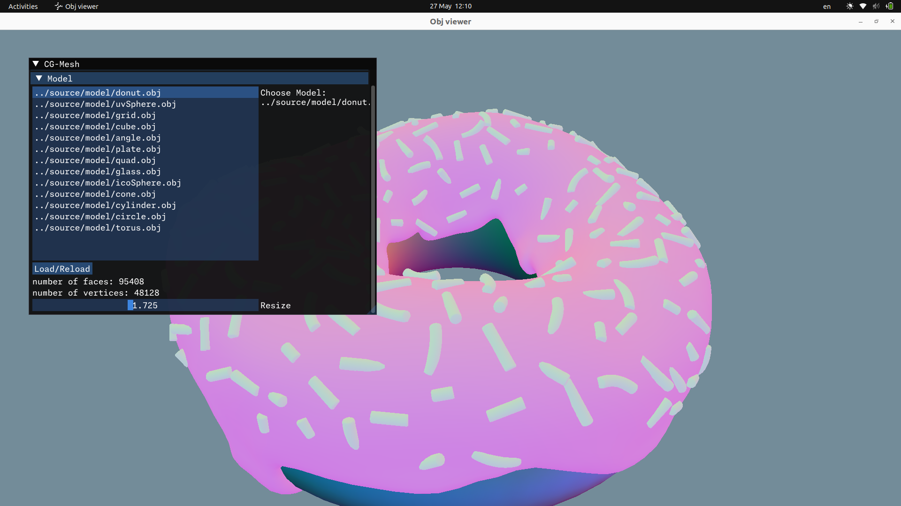

# 服务于计算机图形学课程的几何算法教学系统

# 环境配置

- 操作系统: `Ubuntu 22.04.4 LTS x86_64`
- 编译器：`g++ (Ubuntu 11.4.0-1ubuntu1~22.04) 11.4.0`
- `OpenGL version string: 4.6 (Compatibility Profile) Mesa 23.2.1-1ubuntu3.1~22.04.2`
- `CMake version 3.22.1`

# 编译说明

1. 命令行键入：`sudo apt install libwayland-dev libxkbcommon-dev xorg-dev` 。这些包在从源码构建GLFW中需要，参考链接：https://www.glfw.org/docs/latest/compile.html

2. 命令行键入`cd geometryCGAlgsDemo/build`

3. 输入`cmake ../source`并运行

4. 输入`cmake --build .`并运行

5. 输入`./main`并运行

# UI 说明

- 系统运行后，按照面板加载模型。加载模型后，按住鼠标滚轮可以拖动视角，滚动鼠标滚轮可以前后调整视角。按下W可以关闭/开启线框，按下Esc或者Q可以退出程序。拖动model选项卡下面的Resize条可以做缩放操作。

  

- 我们可以选择各种网格算法。系统共有Loop细分、根号三细分、网格优化三种算法。网格算法在Algorithms选项卡中选中后，点击Run按钮后开始运行。

# 如何编写网格算法

- 本系统的模型读入，网格拓扑，模型绘制均已实现。需要完成的是使用系统中提供的网格拓扑来编写网格处理的算法代码。

- 使用IDE打开source文件夹后，在geometryCGAlgsDemo/source/lib/algorithms文件夹下找到loopSubdivision.h与root3Subdivision.h，找到文件中的TODO记号。补充TODO记号处的函数体。可能的参考文献已经在注释中标出。可以参考geometryCGAlgsDemo/source/lib/algorithms/MeshTopology.h中的网格拓扑结构，此文件中亦给出了网格拓扑的参考文献。

# 模拟结果示例

- 项目中提供了可直接运行的示例：`geometryCGAlgsDemo/elf/main`。同学们可以尝试运行它，调节各种参数，观察处理的结果。
